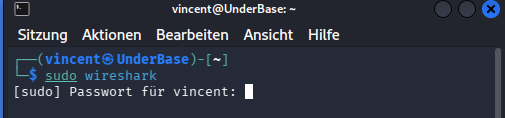
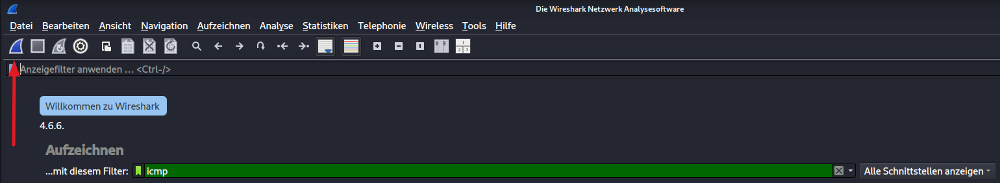
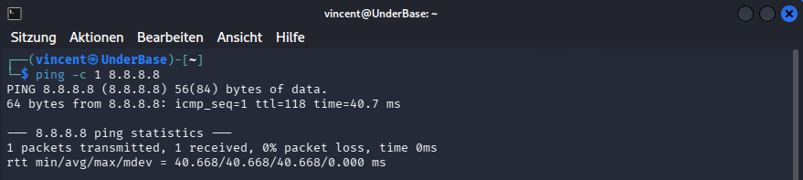
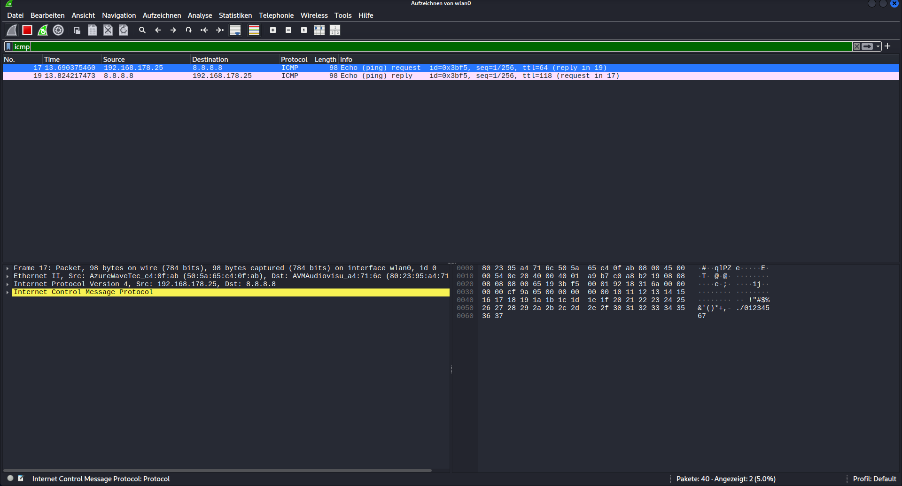
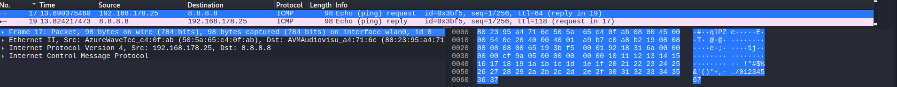
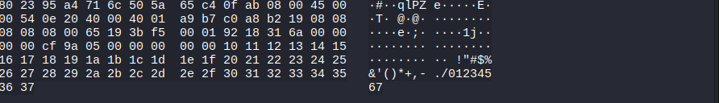

# 01 – Wireshark Basics

## Introduction

Before I could start capturing ICMP packets and working through everything I wanted to learn, I first needed to understand what kind of information to expect from Wireshark.

This is not a guide or breakdown of the Wireshark program or its individual tabs. In this chapter, I am simply sharing my perspective on the first encounter with this program.

What information do I consider important?  
What kind of information do I expect?  
What can be derived from this information?

Since there are already plenty of tutorials and explanatory videos about this program available on the web, I did not want to add to them — but rather to build a basic understanding step by step through practice, exercises, and above all curiosity, and to further develop and expand upon it with each subsequent project.


## What is Wireshark?

Wireshark is a free, open-source network analysis tool originally developed 
by **Gerald Combs** in **1997** in the **United States**. It was initially 
released under the name **Ethereal** and later renamed to **Wireshark in 2006**.

It is — to my knowledge — primarily used in the field of cybersecurity 
and network administration.

Its core purpose is to show the user which information is entering and 
leaving the network the computer is connected to — including **who** sent it, 
**what** the content is, **when** it arrived, and much more.
This is achieved through so-called **packet capturing** — Wireshark intercepts 
and displays the raw data packets traveling through the network in real time.

This makes it an extremely useful tool for:
- Detecting cyberattacks early and defending against them
- Investigating successful attacks after the fact
- **Diagnosing network issues** — it helps identify why and how packets 
  disappear (packet loss), take too long to arrive (high latency/delay), 
  or behave unexpectedly within a network

> **Note:** Wireshark is in itself a complete topic that could easily 
> fill an entire project on its own. I am deliberately keeping this section 
> brief, as my focus here is on the actual core of this project: **ICMP packet analysis.**

## Starting Wireshark

Since I am running this project on Kali Linux, I will note every necessary terminal command along the way.

To launch Wireshark, I opened my terminal (Ctrl+Alt+T) and entered:
`sudo wireshark` — where "sudo" stands for "superuser do" and acts as the master key to execute any command on this machine (the host password will be prompted).





After entering my password, the Wireshark start page opened. As expected, a large number of tabs, information, and configurations were immediately visible at first glance.


In order not to get lost in this forest of information, I highlighted the filter tab — which, even before launching the program, seemed to me the obvious first thing to look for, since I only wanted to work with one specific type of information: ICMP.





The input field turned green after I entered the protocol — a clear sign that the input was valid. This saves an enormous amount of stress and sorting effort.

You will get an idea of what I mean if you have ever opened Wireshark while nothing else was active on the desktop — except for an internet connection.
I personally found such background noise as a beginner to be very overwhelming. You keep discovering more and more knowledge gaps and can quickly get lost in the sheer volume of data. For this reason, I deliberately chose which information to include and which to leave out — since during my research I often had to set things aside the moment I noticed I was drifting too far from the main topic. I want to make it clear that I am not ignoring or hiding any information here, but rather taking everything into account and either incorporating it into the project, or categorizing it and setting it aside for future projects.

With that, my settings for capturing the packet were configured and Wireshark knew what I wanted displayed. By clicking the red arrow button, Wireshark began capturing packets.


Once the capture started, I was immediately met with an empty window. This is where the first advantage of the pre-set filter became apparent — as long as no ICMP request was sent or received, the window stayed empty, which gave me time to actually think about what I was about to see.

For this reason, I divided this screen into 3 areas, which I wanted to understand before sending anything.


Area 1 is divided into 7 columns, which I broke down one by one:


1. **No.** — The frame number (e.g. *Frame 1, Frame 2, ...*), representing the order in which the packets arrived during the capture session.

2. **Time** — By default, this shows the elapsed time in seconds since the capture was started. It can optionally be changed to Unix Epoch Time (seconds counted since January 1st, 1970) via *View → Time Display Format → Unix Epoch*.

3. **Source** — The source IP address — the IP address of the sender.

4. **Destination** — The destination IP address — where the packet is being sent to.

5. **Protocol** — The protocol in which the packet was composed (e.g. ICMP, TCP, UDP).

6. **Length** — The total length of the packet, measured in bytes.

7. **Info** — A brief summary of the packet's content, providing a quick overview without having to inspect it in detail.


------------------------------------------------------------------------------------------------------------------------------


Area 2 and 3 are more closely connected when it comes to gathering information. While Area 3 displays the packet as hexadecimal code, Area 2 helped me understand how that code is structured and what information can be read from it.


In Area 2 I found four tabs:

The "Frame" tab, which shows the number of the packet since the start of the capture. This makes it easier to find and match related packets such as a Request and its corresponding Reply. This tab also highlights the complete hexadecimal code in Area 3.

The next tab is "Ethernet II", which covers the first 14 bytes and contains information about the sender, the receiver, and the protocol type that follows this header.

The "Internet Protocol (IP)" tab covers the next 20 bytes (15–34) and contains information about how the packet is transmitted across the network.

Finally, the "ICMP" tab covers the last 8 bytes (35–42) and contains the actual request information of the packet, including type, code, checksum, identifier and sequence number.


------------------------------------------------------------------------------------------------------------------------------


At this point I felt prepared enough to actually send something and fill these empty fields with real data — so I ran a command to capture both a **request packet** and a **reply packet** for a better overview.

To reliably measure connection speed, a certain number of request packets is usually sent (**Linux: infinite until manually interrupted, Windows: 4 packets** by default). However, this was not necessary for my packet analysis, since I was less interested in the *content* of the packet and more in its **structure**.

The command also needs a **destination IP address or URL**. On Linux it looks like this:

```bash
ping -c 1 8.8.8.8
```

| Part | Meaning |
|------|---------|
| `ping` | The command to send a request packet |
| `-c 1` | Count 1 – how many packets should be sent |
| `8.8.8.8` | My target IP – Google's DNS server, commonly used to test connectivity as it is reliably reachable |

> **Note:** `8.8.8.8` is Google's **public DNS server**. An alternative is `1.1.1.1` by Cloudflare, which is also commonly used for connectivity tests.


------------------------------------------------------------------------------------------------------------------------------





I entered the command in the terminal and within seconds, **2 packets** appeared in Wireshark.


Even without Wireshark, the terminal already gave me some useful information after running the ping command:

```
PING 8.8.8.8 (8.8.8.8) 56(84) bytes of data.
64 bytes from 8.8.8.8: icmp_seq=1 ttl=118 time=40.7 ms
```

| Field | Value | Meaning |
|-------|-------|---------|
| `56(84) bytes` | 56 / 84 bytes | The size of the data being sent – 56 bytes of payload, 84 bytes total including the ICMP header |
| `icmp_seq=1` | 1 | ICMP Sequence Number – this is the 1st packet sent. If multiple packets are sent, this number increases (1, 2, 3...). It helps identify lost or out-of-order packets |
| `ttl=118` | 118 | Time to Live – every packet starts with a TTL value and loses 1 for each router (hop) it passes through. When TTL reaches 0, the packet is discarded. Windows starts at **128**, Linux starts at **64**. Since I received a TTL of 118, Google's server likely started at **128**, meaning the packet passed through **10 hops** to reach me |
| `time=40.7 ms` | 40.7 ms | The round-trip time – how long it took for the packet to travel from my machine to 8.8.8.8 and back |

---

```
--- 8.8.8.8 ping statistics ---
1 packets transmitted, 1 received, 0% packet loss, time 0ms
rtt min/avg/max/mdev = 40.668/40.668/40.668/0.000 ms
```

| Field | Meaning |
|-------|---------|
| `1 packets transmitted, 1 received` | I sent 1 packet and received 1 reply – no packet was lost |
| `0% packet loss` | The connection was stable – all packets arrived successfully |
| `rtt min/avg/max/mdev` | Round-trip time statistics: minimum / average / maximum / deviation. Since I only sent 1 packet, all values are identical at **40.668 ms** |

> **Note:** Worth noting — I made sure Wireshark was already capturing on the correct interface before running the ping command, otherwise the packets would not have been recorded.

------------------------------------------------------------------------------------------------------------------------------





I could now see my 3 familiar areas — this time filled with data.

In **Area 1**, after all the preparation, only the **Info column** still raised some questions, which I wanted to address directly.


---

### Breaking Down the Info Column

At the very beginning, the **ICMP type** is declared:
- **Request** – I am asking / sending a packet out
- **Reply** – The answer comes back

---

| Field | Meaning |
|-------|---------|
| `id=0x3bf5` | The **ICMP Identifier** — used to match a Request with its corresponding Reply. When multiple ping processes run simultaneously, the ID helps distinguish which reply belongs to which request. `0x3bf5` is the hexadecimal representation of **15349** in decimal — this value is randomly assigned by the operating system for each new ping session |
| `seq=1/256` | **1** = my packet sequence number (the 1st packet sent). **256** = the raw **Big-Endian** representation of 1 in a 16-bit format. This pattern continues: 2/512, 3/768, etc. I went deeper into this in the byte breakdown below — it is also **relevant for attack detection**, as manipulated or unexpected sequence values can indicate **ICMP-based attacks such as ping floods or crafted packets** |
| `ttl=64` | **Time to Live** of my outgoing Request packet — since my machine runs Linux, it starts at **64** (as discussed earlier in the terminal output) |
| `ttl=118` | **Time to Live** of the incoming Reply from 8.8.8.8 — Google's server started at **128**, and the packet passed through **10 hops** to reach me |
| `(reply in 19)` | A Wireshark reference — the corresponding **Reply packet** can be found in **row 19** of the packet list |
| `(request in 17)` | A Wireshark reference — the corresponding **Request packet** can be found in **row 17** of the packet list |

> **Note:** I found these references particularly useful — clicking them jumps directly between a request and its reply, making it easy to verify response times and confirm that no packets were lost.

------------------------------------------------------------------------------------------------------------------------------

After breaking down Area 1, the next interesting source of information was hidden in the **interaction between Area 2 and Area 3**.





---

### Area 3 — The Raw Packet

Area 3 caught my interest the most — here I was one step closer to the raw message, almost exactly as the device itself receives it. It is displayed in **hexadecimal**, though the actual transmission happens in **binary**.

In my opinion, professional and effective troubleshooting goes far beyond simply reading error codes. Complex issues demand the **deepest possible understanding of the underlying subject** — in this case, data packets and transmission protocols. Only with this level of knowledge can the true **root cause** of an error or an attack be reliably identified and fully resolved, rather than just partially patched.

> **Why hex and not binary?**
> Binary data is extremely long and hard to read. Hexadecimal is a compact representation — every **1 byte** (8 bits) can be expressed as exactly **2 hex characters**, making it much easier to read and analyze while still being close to the raw data.

---

### Area 2 — The Translator

Area 2 acts as a **translator** between the human-readable labels and the raw hex data.

When I hovered over a field in Area 2 — such as one of the headers already discussed — the corresponding bytes in the hex code on the right side were **highlighted**, showing me exactly which part of the raw packet contained that specific information.

In the screenshot, I am hovering over **Frame 17** — and as I already knew from the earlier breakdown, the **entire hex code is highlighted**, since the Frame layer represents the complete packet from start to finish.

> **Note:** This was one of the most useful things I discovered — hovering over any field immediately shows which bytes belong to it, creating a direct visual link between a protocol label and its raw data.

------------------------------------------------------------------------------------------------------------------------------




One thing I still needed to address was the ASCII representation displayed alongside the hex code in Area 3.

### ASCII — The Human-Readable Side

When Wireshark displays the raw packet data, it shows two columns side by side:

| Column | What it shows |
|--------|--------------|
| Hex | The raw bytes in hexadecimal — precise and complete |
| ASCII | A human-readable interpretation of those same bytes — where possible |

ASCII (American Standard Code for Information Interchange) is a character encoding standard that maps numbers to characters. For example, the hex value 0x41 represents the letter A, 0x48 represents H, and so on.

However — in an ICMP packet, most of the data is not text. The payload of a ping packet contains a pattern of bytes (on Linux, typically the alphabet abcdefghijklmnopqrstuvwxyz...) which can be partially read as ASCII. Everything else — headers, flags, checksums — appears as dots (.) in the ASCII column, meaning those bytes have no printable ASCII representation.

**Why does this matter?**  
In more advanced analysis — for example when inspecting HTTP, FTP or Telnet traffic — the ASCII column becomes extremely powerful, as those protocols transmit data in plain text. Usernames, passwords, entire web requests — all readable directly in the capture. That realization alone made this section worth studying.

------------------------------------------------------------------------------------------------------------------------------


