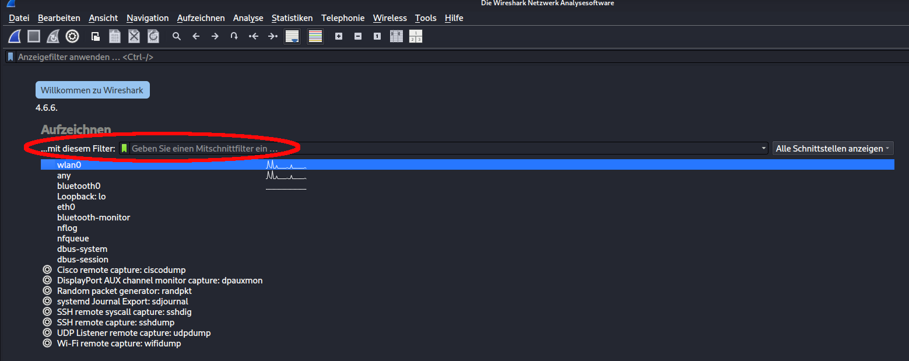
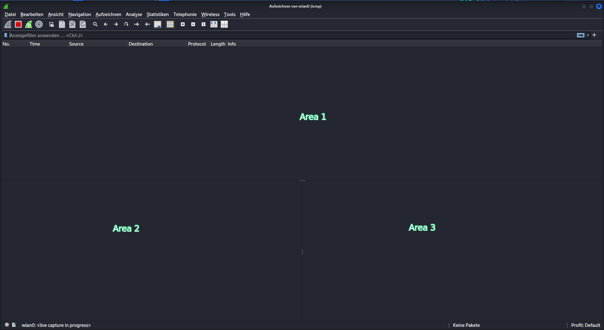
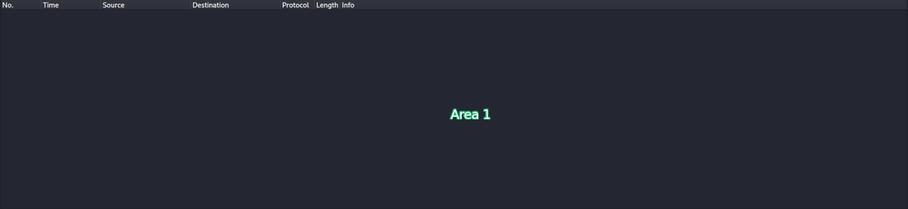
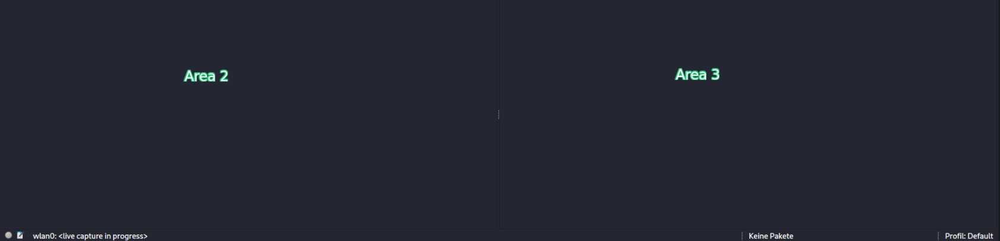

# 01 – Wireshark Basics

## Introduction

In order to begin capturing ICMP packets and to be able to address 
the information to be learned without any issues, it is necessary to 
understand what information we expect from Wireshark.

This will not be a guide or breakdown of the Wireshark program or the 
individual tabs of the interface. In this chapter, I offer the reader — 
whether experienced or a beginner — my perspective on the first encounter 
with this program.

What information do I consider important?  
What kind of information do I expect?  
What can be derived from this information?

Since there are already plenty of tutorials and explanatory videos about 
this program available on the web, I do not wish to add to them, but rather 
to simply and soberly build a basic understanding step by step through 
practice, exercises, and above all curiosity — and to further develop and 
expand upon it with each subsequent project.

## What is Wireshark?

Wireshark is a free, open-source network analysis tool originally developed 
by **Gerald Combs** in **1997** in the **United States**. It was initially 
released under the name **Ethereal** and later renamed to **Wireshark in 2006**.

It is — to my knowledge — primarily used in the field of cybersecurity 
and network administration.

Its core purpose is to show the user which information is entering and 
leaving the network the computer is connected to — including **who** sent it, 
**what** the content is, **when** it arrived, and much more.
This is achieved through so-called **packet capturing** — Wireshark intercepts 
and displays the raw data packets traveling through the network in real time.

This makes it an extremely useful tool for:
- Detecting cyberattacks early and defending against them
- Investigating successful attacks after the fact
- Preventing future attacks
- Protecting your own machine
- Helping both companies and individuals identify weak network structures 
  or active threats
- **Testing network topologies and infrastructures** — Wireshark allows you 
  to verify whether a network is built and functioning correctly
- **Diagnosing network issues** — it helps identify why and how packets 
  disappear (packet loss), take too long to arrive (high latency/delay), 
  or behave unexpectedly within a network

> ⚠️ **Note:** Wireshark is in itself a complete topic that could easily 
> fill an entire project on its own. I am deliberately keeping this section 
> brief — I am aware that I am leaving out a lot of information, but I am 
> doing so intentionally in order to stay focused on the actual core of 
> this project: **ICMP packet analysis.**

## Starting Wireshark

Since I am running this project on Kali Linux, I will note and break down every necessary terminal command.

To launch Wireshark, we open our terminal (Ctrl+Alt+T) and enter:
sudo wireshark, where "sudo" stands for "superuser do" and thus acts as the master key to execute any command on this machine (Note: The host's password will be prompted).

After successfully entering your password, the following start page of the Wireshark program opens. As expected, a large number of tabs, information, and configurations are immediately visible at first glance.

In order not to get lost in this forest of information, I have highlighted the filter tab in the following screenshot — which, even before launching the program, seemed to me the obvious first thing to look for, since I only want to work out a specific type of information for myself here: ICMP.

We already get a sense that our input is valid, as the input field turns green after we have entered the protocol we exclusively want to capture. This saves us an enormous amount of stress and sorting effort.

You will get an idea of what I mean if you have ever opened Wireshark while nothing else was active on the desktop — except for an internet connection!
I personally find such background noise as a beginner to be very overwhelming, as you keep discovering more and more knowledge gaps and can quickly get lost in the sheer volume of data. For this reason, I have deliberately chosen for this project which information to include and which to leave out — since during my research I often had to set things aside the moment I noticed I was drifting too far from the main topic. With that I want to make it clear that I am not ignoring or hiding any information here, but rather taking everything into account and either incorporating it into the project, or categorizing it and setting it aside for future projects.

With that, our settings for capturing our packet are ideally configured and Wireshark now knows what we want displayed and what we don't. By clicking on the red arrow button, Wireshark begins capturing packets.

Once the packet capture begins, we are immediately brought to an empty window. This is where the first advantage of our pre-set filter becomes apparent — as long as we do not send (or receive) an ICMP request, these windows remain empty, allowing us to calmly prepare for the information that awaits us — information that, upon arrival, will directly overwhelm us if we do not know what to expect and where.

For this reason, I have divided this screen into 3 areas for easier explanation, which we must go through in detail before we can even send and receive our first packet!

Area 1 is divided into 7 columns, which can be broken down quickly:

1. **No.** — Displays the frame number (e.g. *Frame 1, Frame 2, ...*), representing the order in which the packets arrived during the capture session.

2. **Time** — By default, this value shows the elapsed time in seconds since the capture was started. It can optionally be changed to Unix Epoch Time (seconds counted since January 1st, 1970) via *View → Time Display Format → Unix Epoch*.

3. **Source** — The source IP address, meaning the IP address of the sender of the packet.

4. **Destination** — The destination IP address of the packet, indicating where it is being sent to.

5. **Protocol** — The protocol in which the packet was composed (e.g. ICMP, TCP, UDP).

6. **Length** — The total length of the packet, measured in bytes.

7. **Info** — A brief summary of the packet's content, providing a quick overview of what the packet contains without having to inspect it in detail.

Area 2 and 3 are more closely connected when it comes to gathering information. While Area 3 displays the packet as hexadecimal code, Area 2 allows us to understand how that code is structured and what information can be read from it.

In Area 2 we can expect four tabs: the "Frame" tab, which tells us the number of the packet since the start of the capture. This makes it easier to find and match related packets such as a Request and its corresponding Reply. This tab also highlights the complete hexadecimal code in Area 3.

The next tab is "Ethernet II", which covers the first 14 bytes and contains information about the sender, the receiver, and the protocol type that follows this header.

The "Internet Protocol (IP)" tab covers the next 20 bytes (15–34) and contains information about how the packet is transmitted across the network.

Finally, the "ICMP" tab covers the last 8 bytes (35–42) and contains the actual request information of the packet, including type, code, checksum, identifier and sequence number.

