# ICMP Paket

Having seen and understood what information Wireshark provides, it becomes easier to understand the structure of a data packet. In the previous data sheet, I broke down the dissector fields from the Packet Details pane (Area 2). This now serves as preparatory work to go one level deeper — examining the raw hex dump in Area 3 and identifying exactly which bytes carry which information, layer by layer (Ethernet → IPv4 → ICMP).

I had already gone through the individual fields in Area 2 — now I wanted to go one step deeper and look at the bytes themselves: which information is stored where.

To have a reference point for which values an ICMP packet can take – and more importantly, which of those are considered **normal**, **suspicious** or **dangerous** – I created a detailed reference table based on my own research, supported by Claude Sonnet (AI) for the HTML structure.

> **Note:** The table is intentionally extensive, but far from complete.
> ICMP is a complex protocol and new attack patterns emerge continuously.

[🌐 ICMP CheatSheet öffnen](https://DaVinci0610.github.io/security-journey/icmp-analysis/ICMP-CheatSheet.html)

- **Quick Reference** – Get a rough first assessment when encountering unknown or unusual values
- **Living Document** – The table is meant to grow over time, filled with new findings and up-to-date information throughout future projects
- **Learning Aid** – Not a substitute for deep understanding, but a useful starting point

### Why Break Down Individual Bytes?

Understanding the byte-level structure of a packet is not just an academic exercise. It is the reason I am doing this — without knowing what the raw data actually looks like, I am only ever working with someone else's interpretation of it.

Relying solely on automated tools is not enough — understanding what is actually happening at the byte level is a skill I want to build, because it is the only way to truly know what you are looking at.

---

Below I go through the complete structure of the captured ICMP packet **layer by layer**, exactly as Wireshark presents it in Area 2:

| Layer | What it covers |
|-------|---------------|
| **Ethernet II** | Source & destination MAC addresses, EtherType |
| **IPv4** | IP header — version, TTL, source & destination IP, checksum and more |
| **ICMP** | Type, code, checksum, identifier, sequence number |
| **Data** | The actual payload — the ping data bytes |

> **Note:** Every single field in Area 2 has a fixed position and size in the raw byte stream. This is what makes network protocols **deterministic and reliable** — every device in the world reads the same bytes in the same order.

------------------------------------------------------------------------------------------------------------------------------

## Ethernet II - Byte 1-14

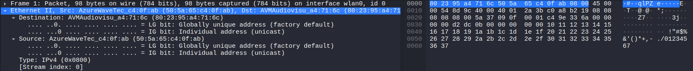

Like the vast majority of modern IP networks, ICMP uses Ethernet II as its foundation for the first 14 bytes of the packet. As the successor to Ethernet I (1980), Ethernet II introduced the EtherType field — a 2-byte field located at bytes 13–14 — which tells the receiver which protocol is carried in the payload. 
As an alternative framing standard, IEEE 802.3 is used in certain other contexts, where those same 2 bytes indicate the frame length instead of the protocol type.


*The first subordinate tab "Destination" of the Ethernet II section can be further subdivided as follows:*

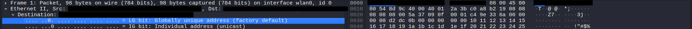


---

### Bytes 1–3: OUI *(Organizationally Unique Identifier)*
- Assigned to manufacturers by the **IEEE**
- Identifies the **manufacturer** of the network card
- Makes up the **first half** of the 6-byte MAC address
- Contains two control bits in the **first byte**:

  - **Bit 1 = LG-Bit** *(Local/Global Bit)*
    - `0` → **Globally unique** – assigned by the manufacturer, worldwide unique *(factory default)*
    - `1` → **Locally administered** – manually set *(e.g. VMs, VPN, software-defined)*

  - **Bit 0 = IG-Bit** *(Individual/Group Bit)*
    - `0` → **Individual (Unicast)** – packet addressed to a single device
    - `1` → **Group (Multicast/Broadcast)** – packet addressed to a group *(e.g. `FF:FF:FF:FF:FF:FF`)*

### All LG/IG Combinations

| LG | IG | Meaning | Example |
|----|----|---------|---------|
| `0` | `0` | Global + Unicast | Normal network card |
| `0` | `1` | Global + Multicast | `01:00:5e:...` *(IPv4 Multicast)* |
| `1` | `0` | Local + Unicast | VM network adapter, VPN |
| `1` | `1` | Local + Multicast/Broadcast | `FF:FF:FF:FF:FF:FF` *(Broadcast is a special case of Multicast)* |

> **Note:** The combination LG=1 / IG=1 is **not exclusively Broadcast** – any locally administered group address falls into this category. `FF:FF:FF:FF:FF:FF` is simply the most well-known example.


---

### Bytes 4–6: NIC Specific *(Network Interface Controller)*
- Freely assigned by the **manufacturer** itself
- Identifies the **individual device** within the manufacturer's product range
- Also called **Extension Identifier** or **Device ID**
- Together with the OUI, forms a **worldwide unique address per network card**
- Uniqueness only guaranteed if the **LG-Bit = 0** (globally administered)

---

### Source MAC Address – Bytes 7–12

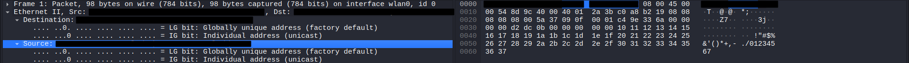

The structure is **identical** to the Destination MAC Address (Bytes 1–6):

### Bytes 7–9: OUI *(Organizationally Unique Identifier)*

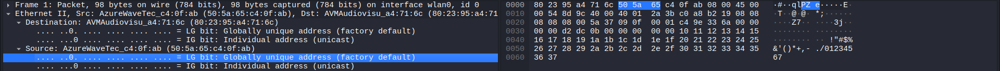

- Assigned to manufacturers by the **IEEE**
- Identifies the **manufacturer** of the **sending** device's network card
- Contains the same two control bits in the **first byte** (Byte 7):

  - **Bit 1 = LG-Bit** *(Local/Global Bit)*
    - `0` → **Globally unique** – assigned by the manufacturer, worldwide unique *(factory default)*
    - `1` → **Locally administered** – manually set *(e.g. VMs, VPN, software-defined)*

  - **Bit 0 = IG-Bit** *(Individual/Group Bit)*
    - `0` → **Individual (Unicast)** – packet sent by a single device *(always the case for Source MAC)*
    - `1` → **invalid** – a packet can only ever be sent by a single device, never by a group; discarded by most devices

> **Note:** The **IG-Bit in the Source MAC is always `0`** according to the IEEE standard, since a packet is always sent by a single device. A value of `1` is technically invalid.

### Bytes 10–12: NIC Specific *(Network Interface Controller)*
- Freely assigned by the **manufacturer** itself
- Identifies the **individual sending device** within the manufacturer's product range
- Also called **Extension Identifier** or **Device ID**
- Together with the OUI, forms a **worldwide unique address per network card**
- Uniqueness only guaranteed if the **LG-Bit = 0** (globally administered)

------------------------------------------------------------------------------------------------------------------------------

### Bytes 13-14: EtherType

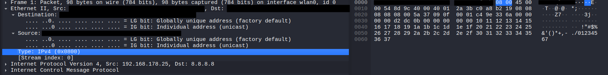

Bytes 13–14 form the **conclusion of the Ethernet II header** and indicate which protocol is encapsulated in the payload that follows.

### Function
- Tells the receiving device **which Layer-3 protocol** follows in the payload
- The receiver uses this value to pass the frame to the **correct protocol handler** *(e.g. IP stack, ARP handler)*
- Also distinguishes **Ethernet II** from **IEEE 802.3** frames:
  - Value **≥ `0x0600`** → **Ethernet II** – value is an EtherType
  - Value **≤ `0x05DC`** → **IEEE 802.3** – value is the **frame length** instead

### Common EtherType Values

| Hex Value | Protocol     |
|-----------|--------------|
| `0x0800`  | IPv4         |
| `0x0806`  | ARP          |
| `0x86DD`  | IPv6         |
| `0x8100`  | VLAN Tag (802.1Q) |


### Wireshark Metadata – `[Stream Index: 0]`

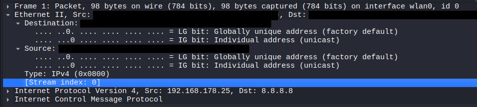

At the end of this section the field `[Stream Index: 0]` appears, which cannot be mapped to any byte in the hex dump. Wireshark adds its own **metadata fields** for analysis purposes and marks them with **square brackets `[ ]`** to distinguish them from actual protocol fields.

These fields exist **only inside Wireshark** – they are not part of the actual network traffic and therefore have **no corresponding bytes in the hex dump**.

Related packets are grouped together into a **stream** (data flow), making it easier to follow and filter entire connections – for example a complete **TCP connection**.

Streams are **numbered sequentially** starting at `0` – so `Stream Index: 0` simply means this packet belongs to the **first detected stream** in the capture.

This can be used directly as a **Wireshark display filter**, e.g.:
- `tcp.stream == 0` → shows only packets belonging to stream 0

### Other Examples of Wireshark-generated Fields `[ ]`

| Field | Meaning |
|-------|---------|
| `[Stream index: 5]` | Packet belongs to the 6th detected stream |
| `[Conversation completeness: ...]` | Indicates whether the stream was captured completely |
| `[Time since first frame in this TCP stream]` | Time elapsed since the first packet of this stream |
| `[Reassembled PDU]` | Wireshark has reassembled multiple packets into a single message |

------------------------------------------------------------------------------------------------------------------------------

## Internet Protocol Version 4 - Byte 15-34

The IPv4 header does not only describe **where the packet is going** – it also contains a range of additional control information:


-**Source & Destination IP Address**:

Describes from where to where the packet is being sent.

> **Note:** The MAC addresses in Ethernet II are responsible for **hop-to-hop** delivery *(from device to device within the same network segment)*. The IP addresses in IPv4 handle **end-to-end** delivery *(from the original sender to the final destination, across multiple networks)*. This is why the IP addresses are repeated here even though a source and destination were already defined in the Ethernet II header.


-**Fragmentation**:

The header describes whether and how the packet may be fragmented:

- **Identification field** – assigns all fragments of the same original packet a **shared ID**, so the receiver knows which fragments belong together
- **Fragment Offset** – indicates the **correct reassembly order** of the fragments
- **Flags field** – controls fragmentation behaviour:

| Flag | Meaning |
|------|---------|
| `DF` *(Don't Fragment)* | The packet must **not** be fragmented |
| `MF` *(More Fragments)* | More fragments **follow** – last fragment has `MF = 0` |


-**TTL** *(Time to Live)*:

A counter that is **decremented by 1 at every router**. When it reaches `0`, the packet is **discarded** and an **ICMP error message** is sent back to the original sender. This prevents packets from circulating endlessly in the network.


-**Protocol Field**:

As usual, indicates **which protocol follows** in the payload.

---

### Byte 15: Version & Internet Header Length


The first byte of the IPv4 header is split into two 4-bit fields:

- **Version** *(upper 4 bits)* – indicates which IP version is being used:
  - `4` → **IPv4**
  - `6` → **IPv6**

- **IHL** *(Internet Header Length, lower 4 bits)* – the value is multiplied by 4 to get the actual header length in bytes:
  - e.g. `5 × 4 = 20 bytes` *(minimum, no options)*
  - e.g. `15 × 4 = 60 bytes` *(maximum, with options)*

> **Note:** The IHL field is necessary because the IPv4 header has a **variable length** due to the optional Options field. Without IHL, the receiver would not know where the header ends and the payload begins.

---

### Byte 16: DSCP/ECN

The second byte of the IPv4 header is itself split into two subfields, which is why Wireshark displays it as an expandable section:


-**DSCP** *(Differentiated Services Code Point)* – upper 6 bits:

Packets are assigned a **priority level**, allowing routers to grant certain packets **preferential treatment** *(Quality of Service – QoS)*.

> **Note:** QoS is particularly relevant in networks where different types of traffic compete for bandwidth – e.g. a VoIP call should not be disrupted by a simultaneous file download.

| DSCP Value | Meaning |
|------------|---------|
| `0`  | **Best Effort** – no special priority *(default)* |
| `46` | **Expedited Forwarding (EF)** – highest priority, e.g. VoIP |
| `34` | **Assured Forwarding (AF)** – medium priority |

-**ECN** *(Explicit Congestion Notification)* – lower 2 bits:

Used to signal **network congestion without discarding packets**. An overloaded router sets this field so that the **receiver** can inform the **sender** to reduce its transmission rate.

> **Note:** Before ECN existed, routers had to **drop packets** to signal congestion – the sender would then notice the packet loss and slow down. ECN is a more efficient alternative that avoids unnecessary packet loss.

| ECN Value | Meaning |
|-----------|---------|
| `00` | No ECN – end device does not support ECN |
| `01` / `10` | ECN-capable packet |
| `11` | **Congestion Experienced** – congestion has been detected |

> **Summary:** This field controls **how important** a packet is *(DSCP)* and whether **network congestion** is being signalled *(ECN)*. In the default case the value is `0x00` – no QoS, no ECN.

---

### Byte 17-18: Total Length

Specifies the **total length of the entire IPv4 packet** in bytes – meaning the **IPv4 header plus its payload**.

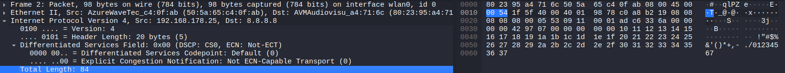


> **What is the payload?**
> The payload is the **data carried by the IPv4 packet** – i.e. everything that comes after the IPv4 header. This is typically a Layer-4 protocol such as **TCP**, **UDP**, or **ICMP**, which in turn carries the actual application data (e.g. a web request or a ping message).

> **Note:** The maximum value of this field is **65,535 bytes** *(2¹⁶ − 1)*, since it is a 16-bit field. In practice, packets are usually much smaller due to the **MTU** *(Maximum Transmission Unit)* of the underlying network – typically **1500 bytes** for Ethernet.

---

### Byte 19-20: Identification

Every IPv4 packet is assigned a **unique identification number** by the sender.


If a packet is **too large** for the network path and must be **fragmented**, all resulting fragments receive the **same identification number** as the original packet. This allows the receiver to recognise which fragments belong together and reassemble them correctly.

> **Note:** The identification number is assigned to **every** packet, not just those that get fragmented. For unfragmented packets it is simply less relevant. The actual reassembly order is determined by the **Fragment Offset** field, not the ID alone.

---

### Byte 21-22: Fragmentation

This field is also expandable in Wireshark, as it contains multiple subfields that control fragmentation behaviour:

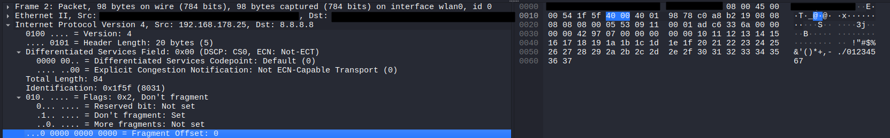


-**Flags** – upper 3 bits

| Bit | Name | Value in capture | Meaning |
|-----|------|-----------------|---------|
| Bit 0 | **Reserved** | `Not set` | Always 0, reserved for future use |
| Bit 1 | **DF** *(Don't Fragment)* | `Set` ✅ | The packet **must not** be fragmented – if it is too large, it is discarded and an ICMP error is returned |
| Bit 2 | **MF** *(More Fragments)* | `Not set` | No more fragments follow – this is either the **last** or the **only** fragment |

> **Note:** In this capture, `DF = Set` and `MF = Not set` – meaning this packet must not be fragmented and is being sent as a single, complete unit.

-**Fragment Offset** – lower 13 bits

| Value | Meaning |
|-------|---------|
| `0` | This is the **first** (or only) fragment – the data starts at the beginning of the original packet |
| `> 0` | This fragment starts at byte offset `value × 8` within the original packet |

> **Note:** In this capture, the Fragment Offset is `0`, confirming that this is an unfragmented packet.

---

### Byte 23: TTL

The sender **sets** the TTL to an initial value when the packet is created. 

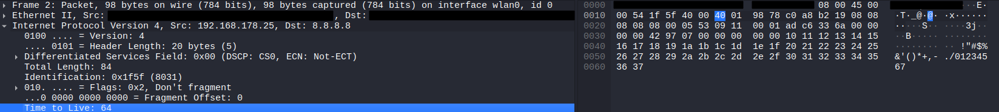

Every router along the path **decrements this value by 1**. If it reaches `0`, the packet is **discarded** and an **ICMP "Time Exceeded" error message** is sent back to the original sender. This prevents packets from circulating endlessly in the network in the event of routing loops.

### Common initial TTL values by operating system

| TTL Value | Operating System |
|-----------|-----------------|
| `64`  | **Linux / macOS** *(default)* |
| `128` | **Windows** *(default)* |
| `255` | **Cisco routers / some Unix systems** |

> **Note:** Because the TTL is decremented at each hop, you can estimate **how many routers** a packet has already passed through. For example, a received TTL of `57` with a starting value of `64` suggests the packet has passed through **7 routers**.

---

### Byte 24: Protocol

This field indicates **which protocol is encapsulated in the payload** – i.e. how the data following the IPv4 header should be interpreted by the receiver.

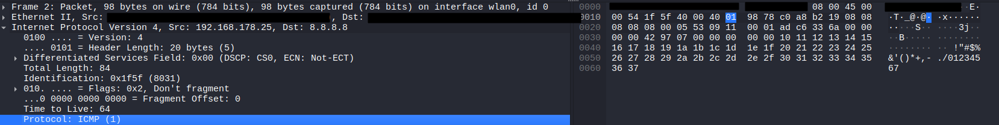

This is the same concept as the **EtherType field** in Ethernet II: just as EtherType tells the receiver what follows after the Ethernet header, the Protocol field tells the receiver what follows after the IPv4 header.

| Value | Protocol | Description |
|-------|----------|-------------|
| `1`   | **ICMP** *(Internet Control Message Protocol)* | Control messages, e.g. ping, traceroute, error reporting |
| `6`   | **TCP** *(Transmission Control Protocol)* | Reliable, connection-oriented data transfer |
| `17`  | **UDP** *(User Datagram Protocol)* | Fast, connectionless data transfer |
| `89`  | **OSPF** *(Open Shortest Path First)* | Routing protocol |

> **In this capture:** The value is `1` → the payload contains an **ICMP** message.

---

### Byte 25-26: Header Checksum

The sender calculates a **checksum over the IPv4 header only** and writes the result into this field. Upon receiving the packet, the receiver **recalculates the checksum** and compares it to the stored value. If the two values do not match, the packet is **silently discarded** – no error message is sent.


> The checksum detects **bit errors** – i.e. individual bits that were accidentally flipped during transmission due to electrical interference or hardware faults. It does **not** detect missing bytes – that is handled by the **Total Length** field and higher-layer protocols.

> **Note:** Every router that forwards the packet must **recalculate** the checksum, because the TTL field changes at every hop – which would otherwise invalidate the checksum.

**Wireshark – Checksum Validation**

Wireshark can verify the checksum, but displays `[validation disabled]` by default. This is intentional and has a technical reason:

Modern operating systems and network cards use **Checksum Offloading** – meaning the checksum is not calculated by the CPU in software, but by the **network card itself in hardware**, just before the packet is physically sent onto the wire. Wireshark, however, captures the packet **before** it reaches the network card – at a point where the checksum has not yet been filled in. This means the checksum field would always appear incorrect, so Wireshark disables validation by default to avoid false alarms.

| Wireshark Display | Meaning |
|-------------------|---------|
| `[validation disabled]` | Wireshark is not checking the checksum *(default)* |
| `[correct]` ✅ | Checksum is valid – header was transmitted without errors |
| `[incorrect, should be 0xXXXX]` ❌ | Checksum mismatch – packet may be corrupted, or checksum offloading is active |
| `[unverified]` | Wireshark cannot verify the checksum in this context |

---

### Byte 27-30: Source IP

These four bytes contain the **IP address of the sender** – i.e. the device that originally created and sent this packet.

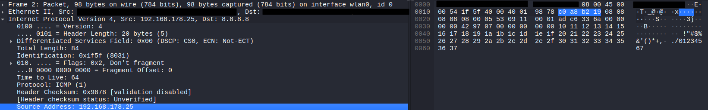

The source IP address is present in **every** IPv4 packet – not just in requests. Both the request and the reply carry their respective sender's IP address.

> **Hop-to-hop vs. end-to-end:** Unlike the MAC address in the Ethernet II header, which changes at every router hop, the **source IP address always remains the address of the original sender** throughout the entire journey across multiple networks. This is what enables the receiver to send a reply back to the correct destination.

---

### Byte 31-34: Destination IP
These four bytes contain the **IP address of the intended recipient** – i.e. the device this packet is ultimately addressed to.

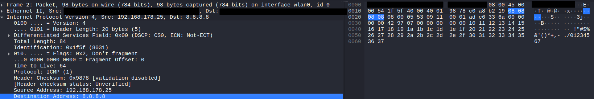

> **Hop-to-hop vs. end-to-end:** The destination IP address also remains **unchanged** across all hops. Every router along the path reads this field to determine where to forward the packet next – but never modifies it. Only the destination MAC address in the Ethernet II header is updated at each hop to reflect the next device on the path.

------------------------------------------------------------------------------------------------------------------------------

## Internet Control Message Protocol - Byte 35-98

With the Ethernet II header (14 bytes) and the IPv4 header (20 bytes) fully parsed, now the payload of the IPv4 packet – the ICMP message, starts at byte 35 of the Ethernet frame.

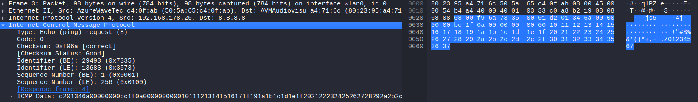

The ICMP section in this capture spans 64 bytes and is divided into two parts:

- Bytes 35–42 form the 8-byte ICMP header, which identifies this message as an Echo Request (ping), carries a checksum to verify the integrity of the entire ICMP message, and contains two identifiers – a Process ID and a Sequence Number – that allow the sender to match each reply to its corresponding request.

- Bytes 43–98 form the 56-byte payload, which contains a timestamp recording the exact moment the ping was sent, followed by padding bytes – a repeating sequence of arbitrary data used purely to fill the packet to its intended size.

---

### Byte 35: Type

This single byte identifies the **type of ICMP message** – it tells the receiver what kind of message this is and how to interpret the rest of the ICMP section.

> **In this capture:** The value is `8` → this is an **Echo Request**, commonly known as a **ping**.

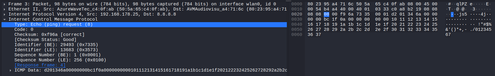

The Type field is the primary identifier in every ICMP message. The most commonly encountered values are:

| Type | Name | Direction | Description |
|------|------|-----------|-------------|
| `0`  | **Echo Reply** | ← receiver → sender | Response to a ping |
| `8`  | **Echo Request** | → sender → receiver | The ping itself |
| `3`  | **Destination Unreachable** | ← router → sender | Packet could not be delivered |
| `11` | **Time Exceeded** | ← router → sender | TTL reached 0; used by traceroute |
| `5`  | **Redirect** | ← router → sender | Router instructs sender to use a different route |

> **Note:** Types `0` and `8` always appear as a pair – every Echo Request *(Type 8)* expects exactly one Echo Reply *(Type 0)* in return. The **Sequence Number** and **Identifier** fields in the ICMP header are used to match each reply to its corresponding request.

---

### Byte 36: Code

This byte acts as a **subtype** of the Type field – it further specifies the meaning of the ICMP message where multiple variants exist for a given type.

> **In this capture:** The value is `0` – which is the only valid code for an Echo Request. It simply means: *no further specification needed*.


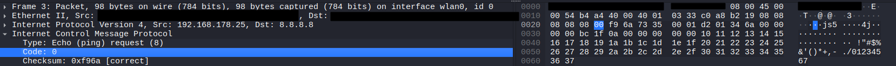

The Code field only becomes meaningful for certain ICMP types. For Echo Request *(Type 8)* and Echo Reply *(Type 0)*, the Code is always `0`. The most relevant examples where Code carries real information are:

**Type 3 – Destination Unreachable**

| Code | Meaning |
|------|---------|
| `0`  | Net Unreachable – the destination network cannot be reached |
| `1`  | Host Unreachable – the destination host cannot be reached |
| `3`  | Port Unreachable – the destination port is not open |
| `4`  | Fragmentation Needed – packet too large, but DF flag is set |

**Type 11 – Time Exceeded**

| Code | Meaning |
|------|---------|
| `0`  | TTL Exceeded in Transit – TTL reached 0 at a router *(used by traceroute)* |
| `1`  | Fragment Reassembly Time Exceeded – fragments did not arrive in time |

> **Summary:** Type and Code always work **together**. Type defines the category of the message; Code defines the specific reason within that category. For a simple ping, both are effectively just formalities – but in error scenarios, the Code field is what tells the sender *exactly* what went wrong.

---

### Byte 37-38: Checksum

These two bytes contain the **checksum of the entire ICMP message** – covering both the ICMP header and its payload. The receiver recalculates the checksum upon arrival and compares it to this value. If they do not match, the packet is silently discarded.

> **Important distinction from the IPv4 Header Checksum:** The IPv4 checksum only covers the IPv4 header itself. The ICMP checksum, by contrast, covers **everything** – the full ICMP header plus all payload bytes. This means any corruption anywhere in the ICMP message will be detected.

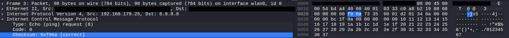

**Why** does Wireshark validate the ICMP checksum by default – but not the IPv4 checksum?

The reason lies in **where** each checksum is calculated:

- The **IPv4 checksum** is typically offloaded to the **network card** *(hardware)*. Wireshark captures the packet before it reaches the network card – at which point the checksum field has not yet been filled in. Validating it would always produce a false error, so Wireshark disables this check by default.

- The **ICMP checksum** is calculated by the **operating system in software**, before the packet is handed to the network card. By the time Wireshark captures the packet, the ICMP checksum is already correctly set and can therefore be validated immediately.

---

### Byte 39-40: Identifier

These two bytes contain a process identifier (PID) – a number assigned by the operating system to uniquely identify which ping process sent this request. When the Echo Reply arrives, the sender uses this value to match the reply to the correct process, especially when multiple ping processes are running simultaneously.

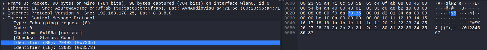

Wireshark displays this field **twice** – not because it occupies 4 bytes, but because the same 2 bytes can be read in two different byte orders:

| Representation | Byte order | Bytes read as | Value in this capture |
|----------------|-----------|---------------|-----------------------|
| **BE** *(Big Endian)* | Most significant byte first | `0x73 0x35` | **29493** |
| **LE** *(Little Endian)* | Least significant byte first | `0x35 0x73` | **13683** |

> **Why both?** ICMP does not mandate a specific byte order for the Identifier field. Different operating systems write it differently:
> - **Linux / macOS** use **Big Endian** *(Network Byte Order)* – the BE value is the actual PID
> - **Windows** uses **Little Endian** *(Host Byte Order)* – the LE value is the actual PID
>
> Since Wireshark cannot determine which OS sent the packet, it displays both interpretations so the correct value is always visible regardless of platform.

---

### Byte 41-42: Sequence Number

These two bytes contain the sequence number of this ping packet. The sequence number starts at 1 for the first Echo Request sent by a process and is incremented by 1 with every subsequent ping – regardless of whether a reply was received.

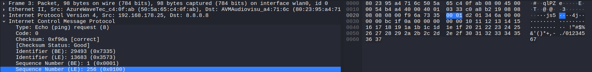

Like the Identifier, the Sequence Number is also displayed in both byte orders by Wireshark, for the same reason:

| Representation | Value in this capture |
|----------------|-----------------------|
| **BE** *(Big Endian)* | **1** `(0x0001)` |
| **LE** *(Little Endian)* | **256** `(0x0100)` |

- The **Identifier** answers: *"Is this reply meant for my process?"*
- The **Sequence Number** answers: *"Is this the reply to this specific packet?"*

| Observation | Meaning |
|-------------|---------|
| Sequence numbers increment normally | Ping is running without issues |
| A sequence number is **missing** in the replies | That packet was lost *(packet loss)* |
| A sequence number appears **twice** | The packet was duplicated in the network |
| Replies arrive **out of order** | Packets took different routes *(reordering)* |


---

### Byte 43-50: Timestamp

Here starts the **Payload**:

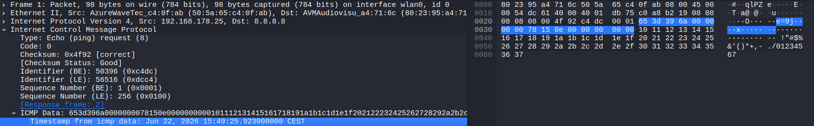

The primary purpose of the timestamp is to measure the **Round-Trip Time (RTT)** – the total time a packet takes to travel from the sender to the destination and back again.

```
Sender dispatches packet  →  timestamp is written into the payload
Echo Reply arrives        →  current time − timestamp = RTT
```

> This is exactly the value that the `ping` command displays as `time=12.3 ms`.

### Important Limitations

| Limitation | Explanation |
|------------|-------------|
| **Only as accurate as the system clock** | The timestamp is generated by the OS – if the clock is not synchronised, the measurement may be inaccurate |
| **No security mechanism** | The timestamp can be forged – it serves purely as a measurement tool, not as an authentication mechanism |
| **OS-dependent behaviour** | **Linux/macOS** write a real timestamp here; **Windows** fills this field with a fixed padding pattern (`0x00` to `0x37`) instead |

### Important Note

> The timestamp is **not an official part of the ICMP standard** – it is part of the **payload**, which the `ping` program fills in itself. The ICMP standard only requires that the receiver returns the payload **unchanged**. What is actually written into it is entirely up to the operating system or the specific `ping` implementation.

---


### Byte 51-98:

The remaining **48 bytes** of the ICMP payload contain nothing but **padding** – a simple, repeating sequence of bytes with no functional meaning. Their sole purpose is to bring the packet to its intended size.

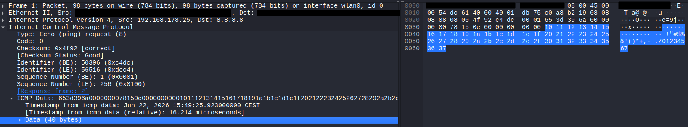

**The pattern in this capture**

In this capture, the padding consists of a straightforward ascending sequence:

```
0x08 0x09 0x0a 0x0b ...  0x37
```

> This is a well-known pattern used by the Linux `ping` implementation. It starts immediately after the 8-byte timestamp and increments by 1 with each byte until the packet reaches its target size.

**Why is padding needed?**

By default, `ping` on Linux sends a payload of **56 bytes** in total:
- **8 bytes** Timestamp
- **48 bytes** Padding

This results in an ICMP packet of **64 bytes** *(8-byte ICMP header + 56-byte payload)*, which has been the traditional default size of `ping` since its earliest implementations. The value `56` was chosen arbitrarily – it simply produces a round total of 64 bytes.

> The payload size can be changed manually:
> ```bash
> ping -s 1400 8.8.8.8   # sends 1400 bytes of payload instead of 56
> ```
> This is commonly used to **test MTU limits** or simulate larger traffic loads.

**OS-dependent** padding patterns

| Operating System | Padding content |
|-----------------|-----------------|
| **Linux** | Ascending byte sequence: `0x08, 0x09, 0x0a, ...` |
| **macOS** | Similar ascending sequence, slight variations possible |
| **Windows** | Fixed repeating alphabet pattern: `abcdefghijklmnopqrstuvwabcdefghi` |

> **Note:** Because different operating systems use distinct padding patterns, the payload content alone can sometimes reveal **which OS sent the packet** – even without looking at the TTL or any other field. This is a minor form of **OS fingerprinting**.

---

**Summary** – Full Packet Structure

| Bytes | Layer | Field | Size |
|-------|-------|-------|------|
| 1–14 | Ethernet II | Destination MAC, Source MAC, EtherType | 14 bytes |
| 15–34 | IPv4 | Version, IHL, DSCP/ECN, Total Length, ID, Flags, TTL, Protocol, Checksum, Src IP, Dst IP | 20 bytes |
| 35–42 | ICMP Header | Type, Code, Checksum, Identifier, Sequence Number | 8 bytes |
| 43–50 | ICMP Payload | Timestamp *(seconds + microseconds)* | 8 bytes |
| 51–98 | ICMP Payload | Padding *(ascending fill pattern)* | 48 bytes |
| **Total** | | | **98 bytes** |
