# ICMP Paket

Having seen and understood what information Wireshark provides, it becomes easier to understand the structure of a data packet. In the previous data sheet, I broke down the dissector fields from the Packet Details pane (Area 2). This now serves as preparatory work to go one level deeper — examining the raw hex dump in Area 3 and identifying exactly which bytes carry which information, layer by layer (Ethernet → IPv4 → ICMP).

I had already gone through the individual fields in Area 2 — now I wanted to go one step deeper and look at the bytes themselves: which information is stored where.

### Why Break Down Individual Bytes?

Understanding the byte-level structure of a packet is not just an academic exercise. It is the reason I am doing this — without knowing what the raw data actually looks like, I am only ever working with someone else's interpretation of it.

Relying solely on automated tools is not enough — understanding what is actually happening at the byte level is a skill I want to build, because it is the only way to truly know what you are looking at.

---

Below I go through the complete structure of the captured ICMP packet **layer by layer**, exactly as Wireshark presents it in Area 2:

| Layer | What it covers |
|-------|---------------|
| **Ethernet II** | Source & destination MAC addresses, EtherType |
| **IPv4** | IP header — version, TTL, source & destination IP, checksum and more |
| **ICMP** | Type, code, checksum, identifier, sequence number |
| **Data** | The actual payload — the ping data bytes |

> **Note:** Every single field in Area 2 has a fixed position and size in the raw byte stream. This is what makes network protocols **deterministic and reliable** — every device in the world reads the same bytes in the same order.

------------------------------------------------------------------------------------------------------------------------------

## Ethernet II - Byte 1-14

Like the vast majority of modern IP networks, ICMP uses Ethernet II as its foundation for the first 14 bytes of the packet. As the successor to Ethernet I (1980), Ethernet II introduced the EtherType field — a 2-byte field located at bytes 13–14 — which tells the receiver which protocol is carried in the payload. 
As an alternative framing standard, IEEE 802.3 is used in certain other contexts, where those same 2 bytes indicate the frame length instead of the protocol type.

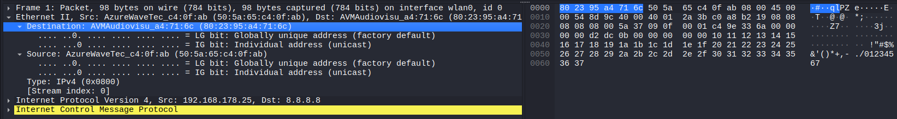

*The first subordinate tab "Destination" of the Ethernet II section can be further subdivided as follows:*

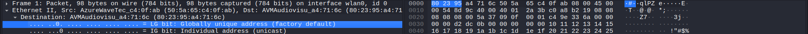

---

### Bytes 1–3: OUI *(Organizationally Unique Identifier)*
- Assigned to manufacturers by the **IEEE**
- Identifies the **manufacturer** of the network card
- Makes up the **first half** of the 6-byte MAC address
- Contains two control bits in the **first byte**:

  - **Bit 1 = LG-Bit** *(Local/Global Bit)*
    - `0` → **Globally unique** – assigned by the manufacturer, worldwide unique *(factory default)*
    - `1` → **Locally administered** – manually set *(e.g. VMs, VPN, software-defined)*

  - **Bit 0 = IG-Bit** *(Individual/Group Bit)*
    - `0` → **Individual (Unicast)** – packet addressed to a single device
    - `1` → **Group (Multicast/Broadcast)** – packet addressed to a group *(e.g. `FF:FF:FF:FF:FF:FF`)*

### All LG/IG Combinations

| LG | IG | Meaning | Example |
|----|----|---------|---------|
| `0` | `0` | Global + Unicast | Normal network card |
| `0` | `1` | Global + Multicast | `01:00:5e:...` *(IPv4 Multicast)* |
| `1` | `0` | Local + Unicast | VM network adapter, VPN |
| `1` | `1` | Local + Multicast/Broadcast | `FF:FF:FF:FF:FF:FF` *(Broadcast is a special case of Multicast)* |

> **Note:** The combination LG=1 / IG=1 is **not exclusively Broadcast** – any locally administered group address falls into this category. `FF:FF:FF:FF:FF:FF` is simply the most well-known example.

---

### Bytes 4–6: NIC Specific *(Network Interface Controller)*
- Freely assigned by the **manufacturer** itself
- Identifies the **individual device** within the manufacturer's product range
- Also called **Extension Identifier** or **Device ID**
- Together with the OUI, forms a **worldwide unique address per network card**
- Uniqueness only guaranteed if the **LG-Bit = 0** (globally administered)

---

### Source MAC Address – Bytes 7–12

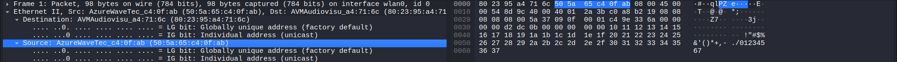

The structure is **identical** to the Destination MAC Address (Bytes 1–6):

### Bytes 7–9: OUI *(Organizationally Unique Identifier)*

- Assigned to manufacturers by the **IEEE**
- Identifies the **manufacturer** of the **sending** device's network card
- Contains the same two control bits in the **first byte** (Byte 7):

  - **Bit 1 = LG-Bit** *(Local/Global Bit)*
    - `0` → **Globally unique** – assigned by the manufacturer, worldwide unique *(factory default)*
    - `1` → **Locally administered** – manually set *(e.g. VMs, VPN, software-defined)*

  - **Bit 0 = IG-Bit** *(Individual/Group Bit)*
    - `0` → **Individual (Unicast)** – packet sent by a single device *(always the case for Source MAC)*
    - `1` → **invalid** – a packet can only ever be sent by a single device, never by a group; discarded by most devices

> **Note:** The **IG-Bit in the Source MAC is always `0`** according to the IEEE standard, since a packet is always sent by a single device. A value of `1` is technically invalid.

### Bytes 10–12: NIC Specific *(Network Interface Controller)*
- Freely assigned by the **manufacturer** itself
- Identifies the **individual sending device** within the manufacturer's product range
- Also called **Extension Identifier** or **Device ID**
- Together with the OUI, forms a **worldwide unique address per network card**
- Uniqueness only guaranteed if the **LG-Bit = 0** (globally administered)

------------------------------------------------------------------------------------------------------------------------------

### Bytes 13-14: EtherType

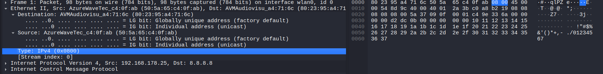

Bytes 13–14 form the **conclusion of the Ethernet II header** and indicate which protocol is encapsulated in the payload that follows.

### Function
- Tells the receiving device **which Layer-3 protocol** follows in the payload
- The receiver uses this value to pass the frame to the **correct protocol handler** *(e.g. IP stack, ARP handler)*
- Also distinguishes **Ethernet II** from **IEEE 802.3** frames:
  - Value **≥ `0x0600`** → **Ethernet II** – value is an EtherType
  - Value **≤ `0x05DC`** → **IEEE 802.3** – value is the **frame length** instead

### Common EtherType Values

| Hex Value | Protocol     |
|-----------|--------------|
| `0x0800`  | IPv4         |
| `0x0806`  | ARP          |
| `0x86DD`  | IPv6         |
| `0x8100`  | VLAN Tag (802.1Q) |

### Wireshark Metadata – `[Stream Index: 0]`

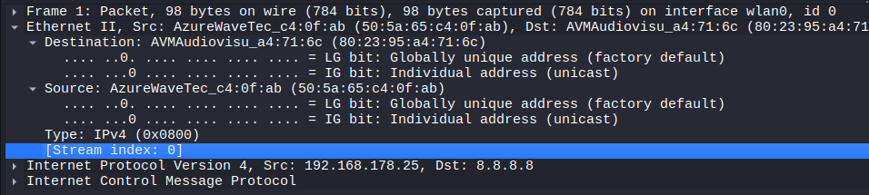

At the end of this section the field `[Stream Index: 0]` appears, which cannot be mapped to any byte in the hex dump. Wireshark adds its own **metadata fields** for analysis purposes and marks them with **square brackets `[ ]`** to distinguish them from actual protocol fields.

These fields exist **only inside Wireshark** – they are not part of the actual network traffic and therefore have **no corresponding bytes in the hex dump**.

Related packets are grouped together into a **stream** (data flow), making it easier to follow and filter entire connections – for example a complete **TCP connection**.

Streams are **numbered sequentially** starting at `0` – so `Stream Index: 0` simply means this packet belongs to the **first detected stream** in the capture.

This can be used directly as a **Wireshark display filter**, e.g.:
- `tcp.stream == 0` → shows only packets belonging to stream 0

### Other Examples of Wireshark-generated Fields `[ ]`

| Field | Meaning |
|-------|---------|
| `[Stream index: 5]` | Packet belongs to the 6th detected stream |
| `[Conversation completeness: ...]` | Indicates whether the stream was captured completely |
| `[Time since first frame in this TCP stream]` | Time elapsed since the first packet of this stream |
| `[Reassembled PDU]` | Wireshark has reassembled multiple packets into a single message |

------------------------------------------------------------------------------------------------------------------------------

## Internet Protocol Version 4 - Byte 15-34

The IPv4 header does not only describe **where the packet is going** – it also contains a range of additional control information:

-**Source & Destination IP Address**:

Describes from where to where the packet is being sent.

> **Note:** The MAC addresses in Ethernet II are responsible for **hop-to-hop** delivery *(from device to device within the same network segment)*. The IP addresses in IPv4 handle **end-to-end** delivery *(from the original sender to the final destination, across multiple networks)*. This is why the IP addresses are repeated here even though a source and destination were already defined in the Ethernet II header.

-**Fragmentation**:

The header describes whether and how the packet may be fragmented:

- **Identification field** – assigns all fragments of the same original packet a **shared ID**, so the receiver knows which fragments belong together
- **Fragment Offset** – indicates the **correct reassembly order** of the fragments
- **Flags field** – controls fragmentation behaviour:

| Flag | Meaning |
|------|---------|
| `DF` *(Don't Fragment)* | The packet must **not** be fragmented |
| `MF` *(More Fragments)* | More fragments **follow** – last fragment has `MF = 0` |

-**TTL** *(Time to Live)*:

A counter that is **decremented by 1 at every router**. When it reaches `0`, the packet is **discarded** and an **ICMP error message** is sent back to the original sender. This prevents packets from circulating endlessly in the network.

-**Protocol Field**:

As usual, indicates **which protocol follows** in the payload.

---

### Byte 15: Version & Internet Header Length

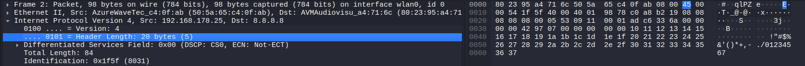

The first byte of the IPv4 header is split into two 4-bit fields:

- **Version** *(upper 4 bits)* – indicates which IP version is being used:
  - `4` → **IPv4**
  - `6` → **IPv6**

- **IHL** *(Internet Header Length, lower 4 bits)* – the value is multiplied by 4 to get the actual header length in bytes:
  - e.g. `5 × 4 = 20 bytes` *(minimum, no options)*
  - e.g. `15 × 4 = 60 bytes` *(maximum, with options)*

> **Note:** The IHL field is necessary because the IPv4 header has a **variable length** due to the optional Options field. Without IHL, the receiver would not know where the header ends and the payload begins.

---

### Byte 16: DSCP/ECN

The second byte of the IPv4 header is itself split into two subfields, which is why Wireshark displays it as an expandable section:

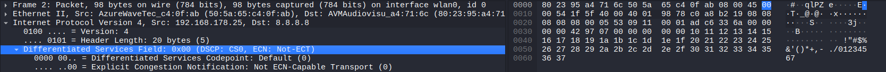

-**DSCP** *(Differentiated Services Code Point)* – upper 6 bits:

Packets are assigned a **priority level**, allowing routers to grant certain packets **preferential treatment** *(Quality of Service – QoS)*.

> **Note:** QoS is particularly relevant in networks where different types of traffic compete for bandwidth – e.g. a VoIP call should not be disrupted by a simultaneous file download.

| DSCP Value | Meaning |
|------------|---------|
| `0`  | **Best Effort** – no special priority *(default)* |
| `46` | **Expedited Forwarding (EF)** – highest priority, e.g. VoIP |
| `34` | **Assured Forwarding (AF)** – medium priority |

-**ECN** *(Explicit Congestion Notification)* – lower 2 bits:

Used to signal **network congestion without discarding packets**. An overloaded router sets this field so that the **receiver** can inform the **sender** to reduce its transmission rate.

> **Note:** Before ECN existed, routers had to **drop packets** to signal congestion – the sender would then notice the packet loss and slow down. ECN is a more efficient alternative that avoids unnecessary packet loss.

| ECN Value | Meaning |
|-----------|---------|
| `00` | No ECN – end device does not support ECN |
| `01` / `10` | ECN-capable packet |
| `11` | **Congestion Experienced** – congestion has been detected |

> **Summary:** This field controls **how important** a packet is *(DSCP)* and whether **network congestion** is being signalled *(ECN)*. In the default case the value is `0x00` – no QoS, no ECN.

---

### Byte 17-18: Total Length

Specifies the **total length of the entire IPv4 packet** in bytes – meaning the **IPv4 header plus its payload**.

> **What is the payload?**
> The payload is the **data carried by the IPv4 packet** – i.e. everything that comes after the IPv4 header. This is typically a Layer-4 protocol such as **TCP**, **UDP**, or **ICMP**, which in turn carries the actual application data (e.g. a web request or a ping message).

> **Note:** The maximum value of this field is **65,535 bytes** *(2¹⁶ − 1)*, since it is a 16-bit field. In practice, packets are usually much smaller due to the **MTU** *(Maximum Transmission Unit)* of the underlying network – typically **1500 bytes** for Ethernet.

---

### Byte 19-20: Identification

Every IPv4 packet is assigned a **unique identification number** by the sender.

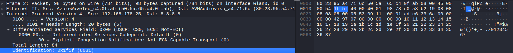

If a packet is **too large** for the network path and must be **fragmented**, all resulting fragments receive the **same identification number** as the original packet. This allows the receiver to recognise which fragments belong together and reassemble them correctly.

> **Note:** The identification number is assigned to **every** packet, not just those that get fragmented. For unfragmented packets it is simply less relevant. The actual reassembly order is determined by the **Fragment Offset** field, not the ID alone.

---

### Byte 21-22: Fragmentation

This field is also expandable in Wireshark, as it contains multiple subfields that control fragmentation behaviour:

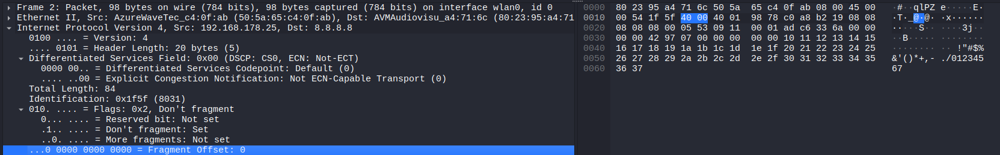

-**Flags** – upper 3 bits

| Bit | Name | Value in capture | Meaning |
|-----|------|-----------------|---------|
| Bit 0 | **Reserved** | `Not set` | Always 0, reserved for future use |
| Bit 1 | **DF** *(Don't Fragment)* | `Set` ✅ | The packet **must not** be fragmented – if it is too large, it is discarded and an ICMP error is returned |
| Bit 2 | **MF** *(More Fragments)* | `Not set` | No more fragments follow – this is either the **last** or the **only** fragment |

> **Note:** In this capture, `DF = Set` and `MF = Not set` – meaning this packet must not be fragmented and is being sent as a single, complete unit.

-**Fragment Offset** – lower 13 bits

| Value | Meaning |
|-------|---------|
| `0` | This is the **first** (or only) fragment – the data starts at the beginning of the original packet |
| `> 0` | This fragment starts at byte offset `value × 8` within the original packet |

> **Note:** In this capture, the Fragment Offset is `0`, confirming that this is an unfragmented packet.

---

### Byte 23: TTL

The sender **sets** the TTL to an initial value when the packet is created. 

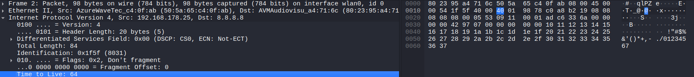

Every router along the path **decrements this value by 1**. If it reaches `0`, the packet is **discarded** and an **ICMP "Time Exceeded" error message** is sent back to the original sender. This prevents packets from circulating endlessly in the network in the event of routing loops.

### Common initial TTL values by operating system

| TTL Value | Operating System |
|-----------|-----------------|
| `64`  | **Linux / macOS** *(default)* |
| `128` | **Windows** *(default)* |
| `255` | **Cisco routers / some Unix systems** |

> **Note:** Because the TTL is decremented at each hop, you can estimate **how many routers** a packet has already passed through. For example, a received TTL of `57` with a starting value of `64` suggests the packet has passed through **7 routers**.

---

### Byte 24: Protocol

This field indicates **which protocol is encapsulated in the payload** – i.e. how the data following the IPv4 header should be interpreted by the receiver.

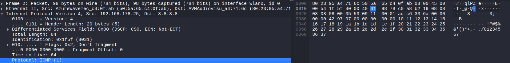

This is the same concept as the **EtherType field** in Ethernet II: just as EtherType tells the receiver what follows after the Ethernet header, the Protocol field tells the receiver what follows after the IPv4 header.

| Value | Protocol | Description |
|-------|----------|-------------|
| `1`   | **ICMP** *(Internet Control Message Protocol)* | Control messages, e.g. ping, traceroute, error reporting |
| `6`   | **TCP** *(Transmission Control Protocol)* | Reliable, connection-oriented data transfer |
| `17`  | **UDP** *(User Datagram Protocol)* | Fast, connectionless data transfer |
| `89`  | **OSPF** *(Open Shortest Path First)* | Routing protocol |

> **In this capture:** The value is `1` → the payload contains an **ICMP** message.

---

### Byte 25-26: Header Checksum

The sender calculates a **checksum over the IPv4 header only** and writes the result into this field. Upon receiving the packet, the receiver **recalculates the checksum** and compares it to the stored value. If the two values do not match, the packet is **silently discarded** – no error message is sent.

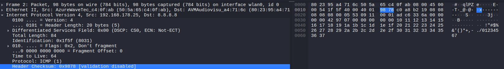

> The checksum detects **bit errors** – i.e. individual bits that were accidentally flipped during transmission due to electrical interference or hardware faults. It does **not** detect missing bytes – that is handled by the **Total Length** field and higher-layer protocols.

> **Note:** Every router that forwards the packet must **recalculate** the checksum, because the TTL field changes at every hop – which would otherwise invalidate the checksum.

**Wireshark – Checksum Validation**

Wireshark can verify the checksum, but displays `[validation disabled]` by default. This is intentional and has a technical reason:

Modern operating systems and network cards use **Checksum Offloading** – meaning the checksum is not calculated by the CPU in software, but by the **network card itself in hardware**, just before the packet is physically sent onto the wire. Wireshark, however, captures the packet **before** it reaches the network card – at a point where the checksum has not yet been filled in. This means the checksum field would always appear incorrect, so Wireshark disables validation by default to avoid false alarms.

| Wireshark Display | Meaning |
|-------------------|---------|
| `[validation disabled]` | Wireshark is not checking the checksum *(default)* |
| `[correct]` ✅ | Checksum is valid – header was transmitted without errors |
| `[incorrect, should be 0xXXXX]` ❌ | Checksum mismatch – packet may be corrupted, or checksum offloading is active |
| `[unverified]` | Wireshark cannot verify the checksum in this context |

---

### Byte 27-30: Source IP

These four bytes contain the **IP address of the sender** – i.e. the device that originally created and sent this packet.

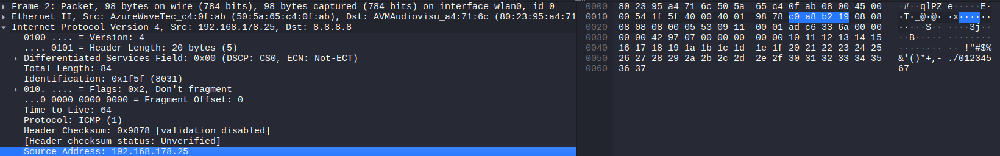

The source IP address is present in **every** IPv4 packet – not just in requests. Both the request and the reply carry their respective sender's IP address.

> **Hop-to-hop vs. end-to-end:** Unlike the MAC address in the Ethernet II header, which changes at every router hop, the **source IP address always remains the address of the original sender** throughout the entire journey across multiple networks. This is what enables the receiver to send a reply back to the correct destination.

---

These four bytes contain the **IP address of the intended recipient** – i.e. the device this packet is ultimately addressed to.

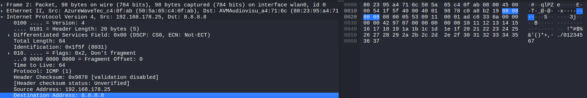

> **Hop-to-hop vs. end-to-end:** The destination IP address also remains **unchanged** across all hops. Every router along the path reads this field to determine where to forward the packet next – but never modifies it. Only the destination MAC address in the Ethernet II header is updated at each hop to reflect the next device on the path.